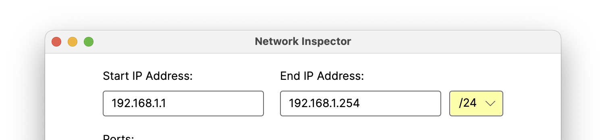

# About Network Inspector
Network inspector is a basic cross-platform network scanner written in C# .NET using [Avalonia UI](https://github.com/AvaloniaUI/Avalonia). The program's primary purpose is to determine which IP addresses from a given range are online and which ports they have open. This makes it a useful tool for locating devices and troubleshooting network issues.

**NOTE:** This program was written explicitly for the purpose of being a helpful troubleshooting tool. Please use it responsibly.
 
 
 

## Installation

### MacOS
1. Download the Network Inspector DMG file from the most recent version available in the releases folder (or click here).
2. Double-click the image to mount it. It should open automatically.
3. Drag the Network Inspector app into the applications folder
 
 
 

## Instructions
1. When the program is opened, the main window will be displayed.

 
 
 
2. The address range to be scanned can be set via the Start IP Address and End IP Address fields:

 
 
Currently only IPv4 addresses are supported.
 
 
 
3. Alternatively, the address range can be set using a subnet mask by selecting an appropriate CIDR string from the drop-down next to the End IP Address field.

 
 
This will update the End IP Address field based on the current value of the Start IP Address field.
 
 
 
4. The TCP ports to scan for can be specified via the ports field. UDP is not currently supported:

 
 
 
5. Once the appropriate addresses and ports have been specified, the scan can be started with the scan button at the bottom of the window:

 
 
 
6. The scan results will populate in real-time in the area above the scan button:

7. If a large number of ports have been specified, this process can take a while. If needed, the scan can be canceled early by clicking the scan button (located in the same place as the cancel button):

 
 
 

## Regarding UDP Support
Currently scanning for open UPD ports is not supported. Due to the UDP protocol's "fire-and-forget" nature, while it is sometimes possible to determine when a system isn't listening for UDP traffic on a specific port, it usually isn't possible to confirm when a system is.